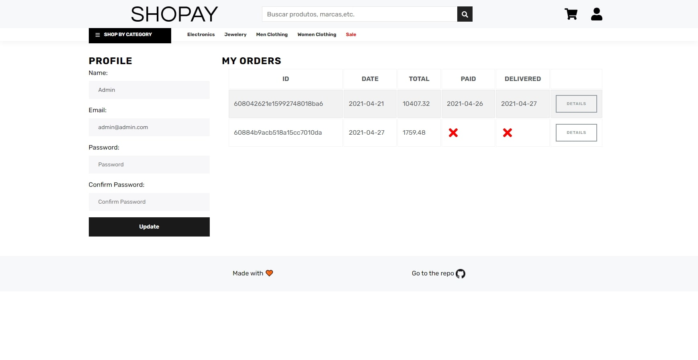

<p align="center">
    
</p>

<p align="center">
    <a href="README.md">English</a>
    ·
    <a href="README-PT.md">Portuguese</a>
 </p>

# Sobre o projeto

Este projeto sem dúvida foi o meu maior até agora e também o que eu mais aprendi. Comecei este projeto com pensamento voltado para o seu MVP, então escolhi bootstrap para estilização e redux para gerenciamento de estado. Foi realmente incrível perceber que eu não tinha lacunas tão grandes no meu conhecimento, a maior delas sendo a no quesito de segurança para o back-end, mas foi relativamente tranquilo. Depois de terminar o app (front e back), decidi mudar o visual e tirar o bootstrap do projeto, então usei o Storybook enquanto criava os novos componentes e utilizei Styled Components para estilização.

# Demonstração

<a title="Distribuído com heroku" href="http://shopay-app.herokuapp.com/">

</a>

#### Logins

```
admin@admin.com
123123

jDoe@email.com
123123

dummy@email.com
12345
```

# Screenshots

<details><summary>Home</summary>
<p>

</p>
</details>
<details><summary>Produto</summary>
<p>

</p>
</details>
<details><summary>Categoria</summary>
<p>

</p>
</details>
<details><summary>Carrinho</summary>
<p>

</p>
</details>
<details><summary>Perfil</summary>
<p>

</p>
</details>

# Funcionalidade

- [x] Busca / Listagem de produtos
- [x] Carrinho de compras totalmente funcional
- [x] Avaliações e classificações de produtos
- [x] Paginação de produto
- [x] Recurso de pesquisa de produto
- [x] Perfil de usuário com pedidos
- [x] Marcar pedidos como uma opção entregue
- [x] Processo de checkout (envio, forma de pagamento, etc)
- [x] Integração com PayPal e Mercado Pago
- [ ] Testes
- [ ] Design responsivo
- [ ] Painel de Administração
- [ ] Renderização do lado do servidor

# Technologias

## Front-end

- [Create React App](https://create-react-app.dev/)
- [Axios](https://github.com/axios/axios)
- [Styled Components](https://styled-components.com/)
- [Storybook](https://storybook.js.org/)
- [React icons](https://react-icons.github.io/react-icons/)
- [React Paypal button (v2)](https://www.npmjs.com/package/react-paypal-button-v2)
- [Redux](https://react-redux.js.org/)
  - [Thunk](https://github.com/reduxjs/redux-thunk)

### Estrutura de pastas

I used a Rails-style pattern [[ref](https://livebook.manning.com/book/redux-in-action/chapter-11/9)], so each file type resides in an appropriately named directory: actions, reducers, components, etc. The only caveat is that I used the [Atomic Deisgn methodology](https://atomicdesign.bradfrost.com/chapter-2/) for separating components and make it easier to understand what does what at a glance

Eu usei um padrão do Rails [[ref](https://livebook.manning.com/book/redux-in-action/chapter-11/9)], Que é quando tipo de arquivo fica em uma pasta com seu nome: actions, reducers, components, etc. E também usei a [metodologia de design Atomic](https://atomicdesign.bradfrost.com/chapter-2/) para separar componentes e tornar mais fácil entender o que eles fazem sem precisar avaliar o código.

```
┌───actions
│   └─ Conjunto de actions do Redux
├───reducers
│   └─ Conjunto de reducers do Redux
├───types
│   └─ Constantes usadas no Redux
├───components
│   ├───atoms
│   │   └─ A menor parte de um componente
│   ├───molecules
│   │   └─ Combinações de atomos
│   └───organisms
│       └─ Combinações maiores usando atomos e moleculas
├───pages
│   └─ Combinação de organismos e requisição de dados
└───styles
    └─ Estilo globais/Muito usados
```

## Back-end

- [Node.js](https://nodejs.org/en/)
- [Axios](https://github.com/axios/axios)
- [Mongoose](https://mongoosejs.com/)
- [Bcrypt.js](https://github.com/dcodeIO/bcrypt.js)
- [Express](https://expressjs.com/pt-br/)
- [Express Async Handler](https://github.com/Abazhenov/express-async-handler#readme)
- [JSONWebToken](https://jwt.io/)
- [Mercado Pago SDK](https://github.com/mercadopago/sdk-nodejs)
- [Multer](https://github.com/expressjs/multer)

### Estrutura de pastas

No back-end eu escolhi fazer o clássico MVC (Model-View-Controller, no caso sem o View,) com algumas mudanças para torná-lo mais facil de desenvolver à API. Outra coisa que também vale a pena mencionar é que estou usando importações ES6/ESM.

```
├───config
│   └─ Configurações
├───controllers
│   └─ Logica de negocio
├───data
│   └─ Dados usados no "seeder"
├───middleware
│   └─ Middlewares (Autenticação and Erros)
├───models
│   └─ Esquema do BD
├───routes
│   └─ Rotas API
├───uploads
│   └─ Destino de imagens upadas
└───utils
    └─ Functions utilitarias
```

# Issues / PR

Sinta-se à vontade para criar uma nova issue com o respectivo título e descrição no repositório. Se você já encontrou uma solução para o seu problema, adoraria revisar sua pull request!

⭐ Se você gostou do projeto não se esqueça de dar uma estrela a este repo, eu ficaria bastante grato!

# Rodando localmente

Não se esqueça de configurar o .env do backend, use o seguinte modelo:

```
PORT=
MONGO_URI=mongodb+srv://<username>:<password>@cluster0.7arhk.mongodb.net<database>?retryWrites=true&w=majority
JWT_TOKEN=
PAYPAL_CLIENT_ID=
MERCADO_PAGO_ACCESS_TOKEN=
```

```bash
# Clonar
$ git clone https://github.com/Rawallon/Ecommerce-react-redux-app && cd Ecommerce-react-redux-app

# Install as dependencias do front-end
$ cd frontend && npm i && cd ..

# Instala as dependencias do back-end
$ cd backend && npm i && cd ..

# Instala o concurrently
$ npm i

# Joga dados no seu BD
$ npm  run data:import

# Roda front e back
$ npm start

# Você pode rodar individualmente usando
# npm run client
# npm run server
```
