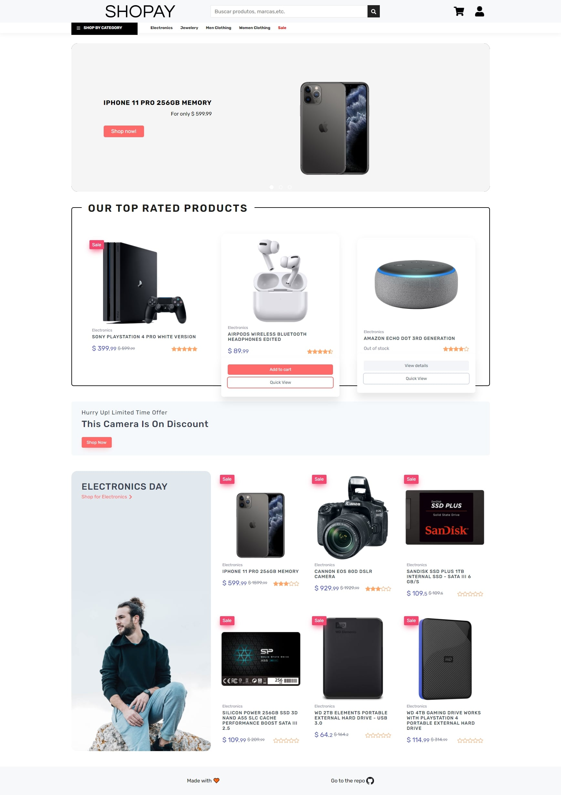
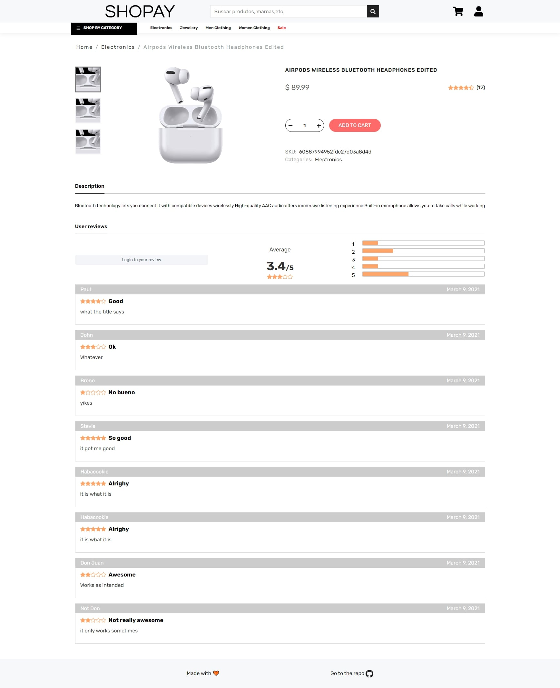
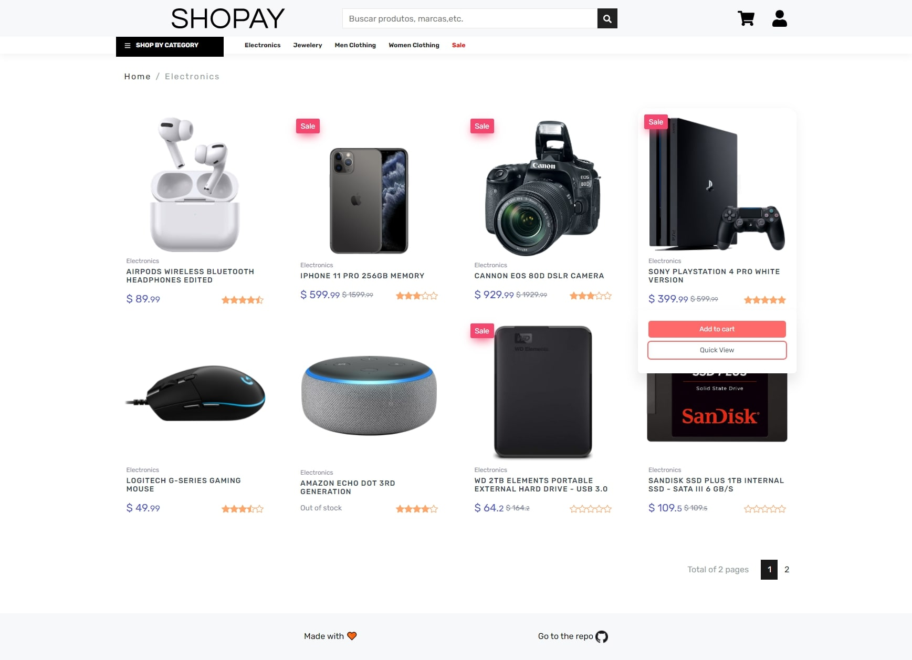
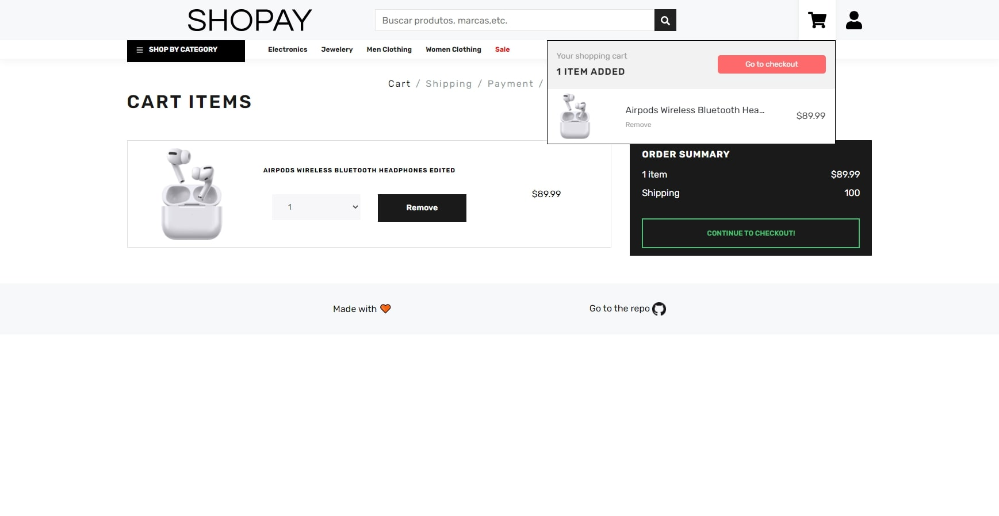
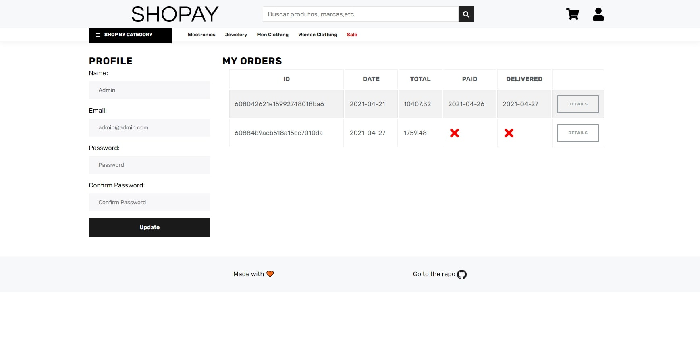

<p align="center">
    
</p>

<p align="center">
    <a href="README.md">English</a>
    ·
    <a href="README-PT.md">Portuguese</a>
 </p>

# Table of Contents

- [About the project](#About-the-project)
- [Live Demo](#Live-Demo)
- [Screenshots](#Screenshots)
- [Functionality](#Functionality)
- [Technologies](#Technologies)
  - [Front-end](#Front-end)
  - [Back-end](#Back-end)
- [Issues / PR](#Issues-/-PR)
- [How to run](#How-to-run)

# About the project

This project was my biggest one so far and without a doubt the one that I most learned from. I started this project with its MVP in mind, so I picked bootstrap for styles and redux for state management. It was really awesome to realize that I didn't have any huge gaps in my knowledge, the biggest one being back-end security, but it was relatively smooth sailing. After finishing both ends (front and back) of the app I decided to change the visual and take bootstrap out of the project, so I used Storybook while designing the new components and Styled Components for styling.

# Live Demo

<a title="Deployed on heroku" href="https://podcastr-rawallon.vercel.app/">

</a>

#### Logins

```
admin@admin.com
123123

jDoe@email.com
123123

dummy@email.com
12345
```

# Screenshots

<details><summary>Home</summary>
<p>

</p>
</details>
<details><summary>Product</summary>
<p>

</p>
</details>
<details><summary>Category</summary>
<p>

</p>
</details>
<details><summary>Cart</summary>
<p>

</p>
</details>
<details><summary>Profile/Orders</summary>
<p>

</p>
</details>

# Functionality

- [x] Product fetching/sorting
- [x] Fully functional shopping cart
- [x] Product reviews and ratings
- [x] Product pagination
- [x] Product search feature
- [x] User profile with orders
- [x] Mark orders as delivered option
- [x] Checkout process (shipping, payment method, etc)
- [x] PayPal and Mercado Pago integration
- [ ] Tests
- [ ] Responsive design
- [ ] Admin Panel
- [ ] Server Side Rendering

# Technologies

## Front-end

- [Create React App](https://create-react-app.dev/)
- [Axios](https://github.com/axios/axios)
- [Styled Components](https://styled-components.com/)
- [Storybook](https://storybook.js.org/)
- [React icons](https://react-icons.github.io/react-icons/)
- [React Paypal button (v2)](https://www.npmjs.com/package/react-paypal-button-v2)
- [Redux](https://react-redux.js.org/)
  - [Thunk](https://github.com/reduxjs/redux-thunk)

### Folder Structure

I used a Rails-style pattern [[ref](https://livebook.manning.com/book/redux-in-action/chapter-11/9)], so each file type resides in an appropriately named directory: actions, reducers, components, etc. I also used the [Atomic Design methodology](https://atomicdesign.bradfrost.com/chapter-2/) for separating components and make it easier to understand what does what at a glance.

```
┌───actions
│   └─ Collection of Redux action
├───reducers
│   └─ Collection of Redux reducers
├───types
│   └─ Constants used in Redux
├───components
│   ├───atoms
│   │   └─ The smallest part of a component
│   ├───molecules
│   │   └─ Small combinantions of atoms
│   └───organisms
│       └─ Larger combinations of atoms and molecules
├───pages
│   └─ Combination of organisms and deals with getting the data
└───styles
    └─ Global/Commonly used styles
```

## Back-end

- [Node.js](https://nodejs.org/en/)
- [Axios](https://github.com/axios/axios)
- [Mongoose](https://mongoosejs.com/)
- [Bcrypt.js](https://github.com/dcodeIO/bcrypt.js)
- [Express](https://expressjs.com/pt-br/)
- [Express Async Handler](https://github.com/Abazhenov/express-async-handler#readme)
- [JSONWebToken](https://jwt.io/)
- [Mercado Pago SDK](https://github.com/mercadopago/sdk-nodejs)
- [Multer](https://github.com/expressjs/multer)

### Folder Structure

In the back-end I chose to stick with the classic MVC (Model-View-Controller, without a View) with a few changes to make it more API friendly. Another thing also worth mentioning is that I'm using ES6/ESM imports.

```
├───config
│   └─ Configurations
├───controllers
│   └─ Business logic
├───data
│   └─ Data used by the seeder
├───middleware
│   └─ Middlewares (Auth and error handler)
├───models
│   └─ Database schemas
├───routes
│   └─ API Routes
├───uploads
│   └─ Images uploaded
└───utils
    └─ Utilitary functions
```

# Issues / PR

Feel free to file a new issue with a respective title and description on the repository. If you already found a solution to your problem, I would love to review your pull request!

⭐ If you like what you see dont forget to star this project, I would really appreciated it!

# How to run

Don't forget to configure backend .env, use the following template:

```
PORT=
MONGO_URI=mongodb+srv://<username>:<password>@cluster0.7arhk.mongodb.net<database>?retryWrites=true&w=majority
JWT_TOKEN=
PAYPAL_CLIENT_ID=
MERCADO_PAGO_ACCESS_TOKEN=
```

```bash
# Clone the repo
$ git clone https://github.com/Rawallon/Ecommerce-react-redux-app

# Install front-end dependencies
$ cd frontend && npm i

# Return to root folder
$ cd ..

# Install back-end dependencies
$ cd backend && npm i

# Return to root folder
$ cd ..

# Install concurrently
$ npm i

# Feed data into your DB
$ npm  run data:import

# Runs both ends
$ npm start

# Alternatively you can start individually
# npm run client
# npm run server
```
